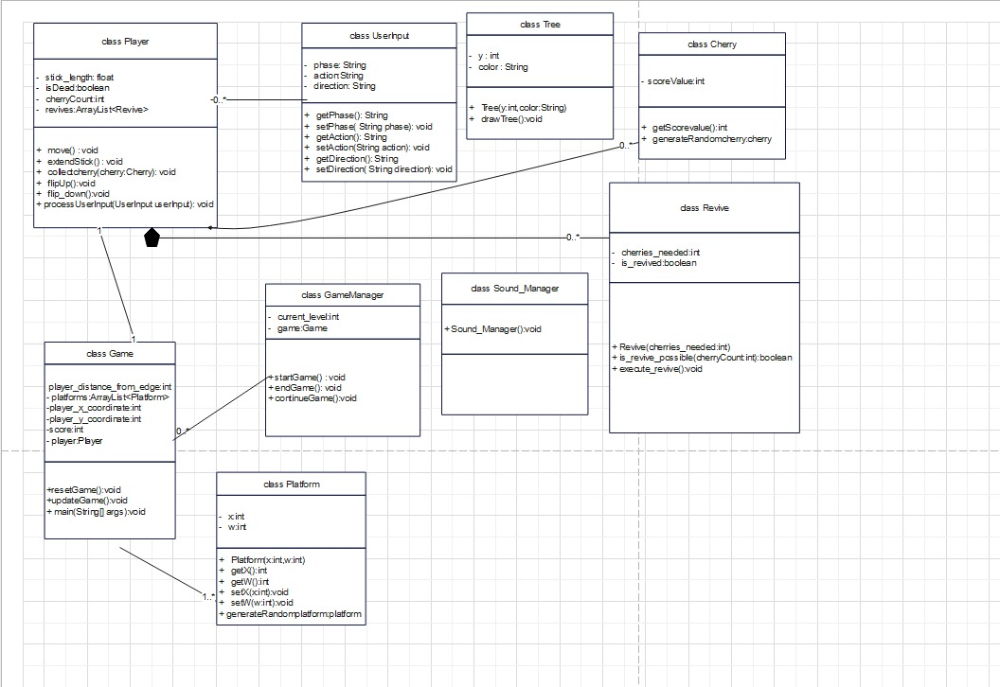

# Stick Hero Game

This is my AP course project,we were tasked with implementing a game inspired by Stick Hero using JavaFX and object-oriented programming (OOP) concepts. Game emulate the core mechanics of Stick Hero while adding our own creative twist.

## Game Mechanics:

1. he game should include a reviving feature, which allows the player to be revived once using a certain amount of cherries which can be collected during the game - 2 , 4 , 8 .

2. The character should collect rewards, such as cherries, as in the original game, by flipping the player upside down using user input while traversing platforms. These rewards should add to the player's score.

3. success land + 1 score

4. perfect land (red part ) +1 score

5. best score , total cherries will be saved in file

6. restart a level , save previous game

## UML

