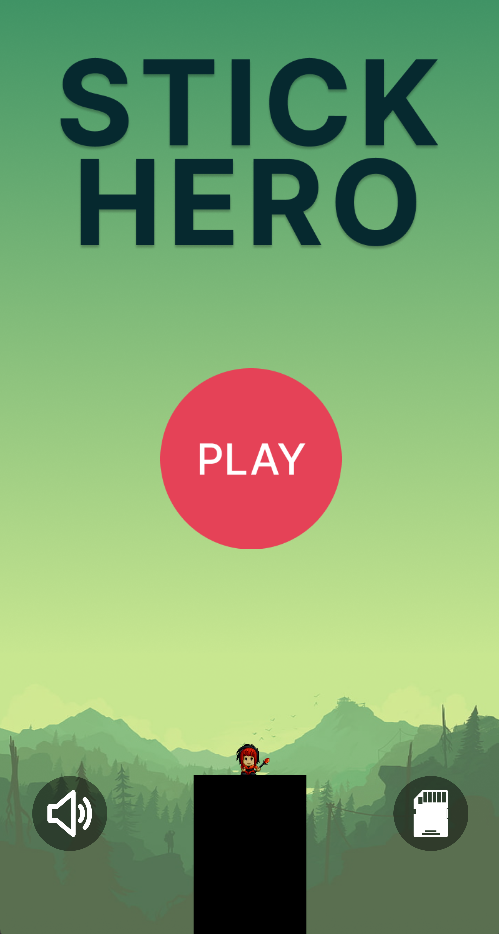

# Stick Hero

# Introduction

This project implements a clone of mobile game "Stick hero", Game was created using javafx and fxml with maven and utilizes important OOPs concept such as :

-   Encapsulation
-   Inheritance
-   Polymorphism
-   Abstraction
-   Interfaces
-   JUnit Testing (Junit 5)
-   Data Serialisation
-   Design Patterns
-   Exception Handling

## Game Mechanics

-   **Character Control:** Players control Stick-Hero, navigating between platforms and extending a stick to bridge the gaps between pillars.
-   **Multiple Pillars:** The game features various pillars of different widths, creating diverse challenges for players.
-   **Precision Timing:** Landing on platforms requires precise timing of the stick extension. Failing to land results in the character falling into the abyss and ending the game.
-   **Reviving Feature:** Players have the chance to be revived once using cherries collected during gameplay. The cherries are utilized for revival but are deducted from the player's score upon revival.
-   **Reward Collection:** Stick-Hero collects rewards like cherries by flipping upside down while traversing platforms. These rewards contribute to the player's score.
-   **Scoring System:** The game features a scoring system that incentivizes players to aim for higher scores by collecting more rewards.
-   **Progress Saving:** Players can save their progress at any point during gameplay, storing information like the last score, highest score achieved, and total cherries collected.
-   **Enhancements:** Game includes graphics, sound effects, and animations to create an immersive gaming experience.

# Game Play

## Home Screen

## Play Screen

## Pause Screen

## GameOver Screen

## UML Diagram

